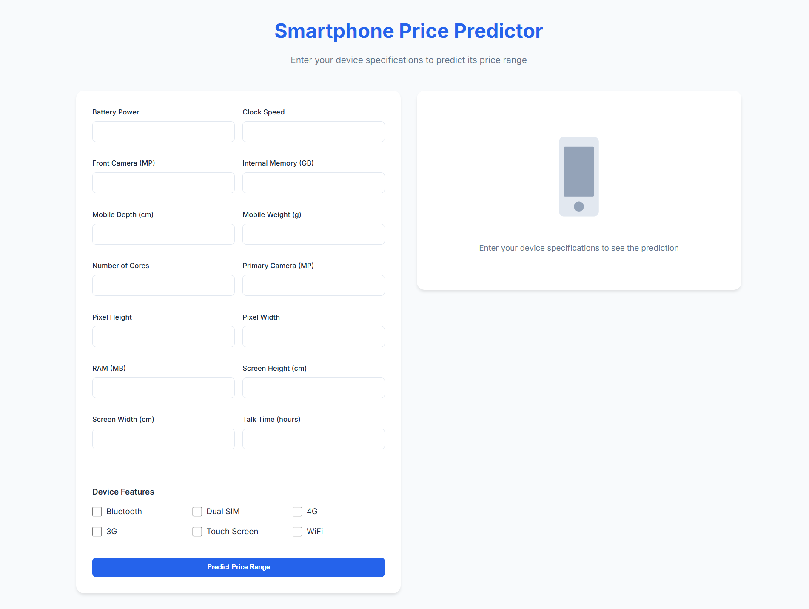

# Smartphone Price Predictor

A web application that predicts smartphone price ranges using a machine learning model deployed on [AWS SageMaker](https://aws.amazon.com/sagemaker/).

## Features

- Predicts smartphone price range in 4 categories:
  - Budget mobile phone
  - Lower mid-range phone
  - Upper mid-range phone
  - Premium phone
- Interactive web interface with real-time predictions
- Responsive design that works on desktop and mobile devices
- Handles 20 different smartphone specifications for prediction

## Tech Stack

- **Frontend**: HTML, CSS, JavaScript
- **Backend**: [Flask](https://flask.palletsprojects.com/en/2.2.x/) (Python)
- **ML Model Deployment**: [AWS SageMaker](https://aws.amazon.com/sagemaker/)
- **AWS Services**: AWS Sagemaker, AWS S3, AWS IAM, AWS CLI

## Prerequisites

- Python 3.x
- [AWS Account](https://aws.amazon.com/) with appropriate credentials
- [Boto3 library](https://boto3.amazonaws.com/)
- [Flask](https://flask.palletsprojects.com/en/2.2.x/)

## Installation

1. Clone the repository
```bash
git clone https://github.com/souradeepdutta/Mobile-Price-Predictor-using-AWS-Sagemaker.git
cd smartphone-price-predictor
```

2. Install required packages
```bash
pip install flask boto3
```

3. Configure AWS credentials
```bash
aws configure
AWS_ACCESS_KEY_ID='your-access-key'
AWS_SECRET_ACCESS_KEY='your-secret-key'
AWS_REGION='ap-south-1'
```

## Usage

1. Start the Flask application:
```bash
python app.py
```

2. Open a web browser and navigate to `http://localhost:5000`

3. Enter the smartphone specifications in the form:
   - Basic specifications (RAM, storage, processor, etc.)
   - Camera details
   - Screen specifications
   - Additional features (Bluetooth, WiFi, etc.)

4. Click "Predict Price Range" to get the prediction

## Screenshots


*Smartphone Price Predictor Web Interface*

## [Youtube Walkthrough](https://www.youtube.com/watch?v=WR_Yj6XPgUE)
[](https://www.youtube.com/watch?v=WR_Yj6XPgUE)


